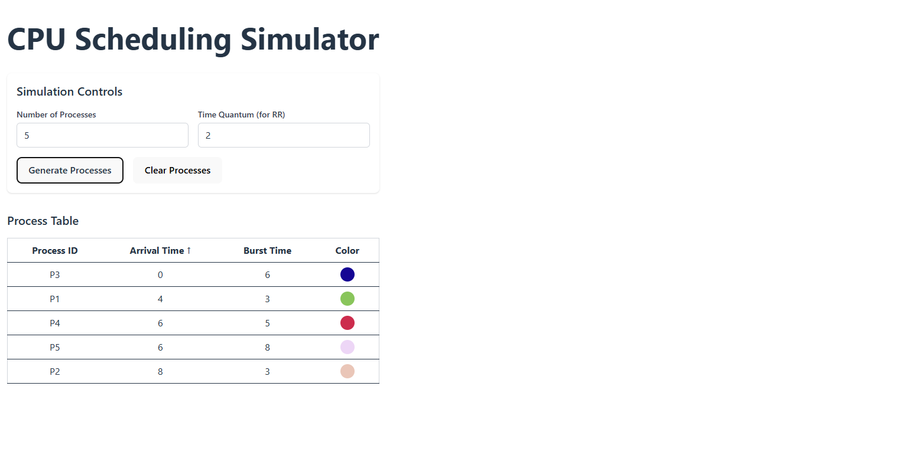
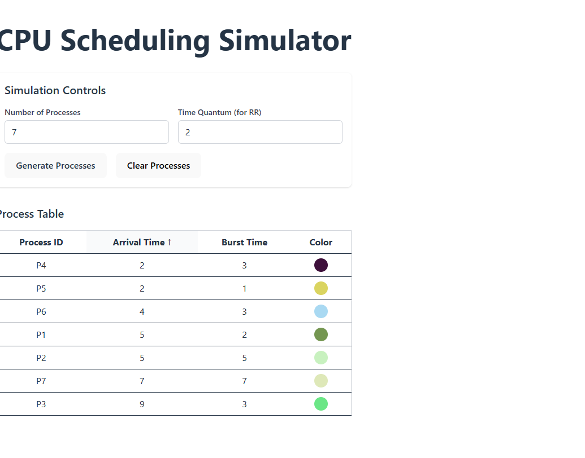
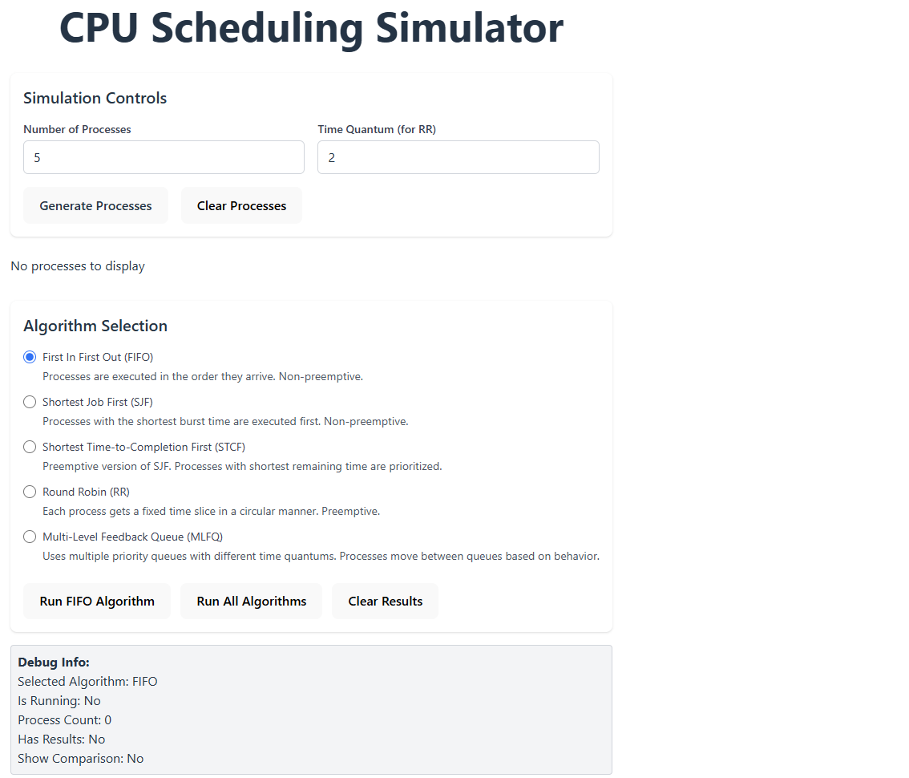
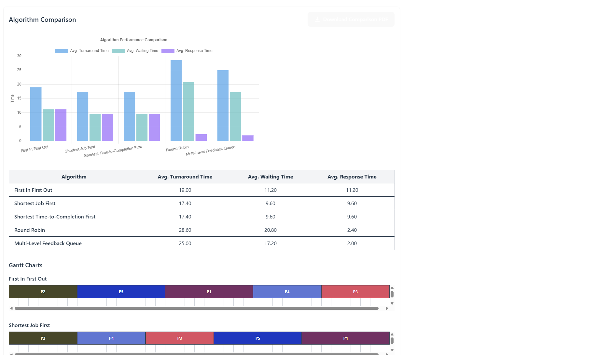
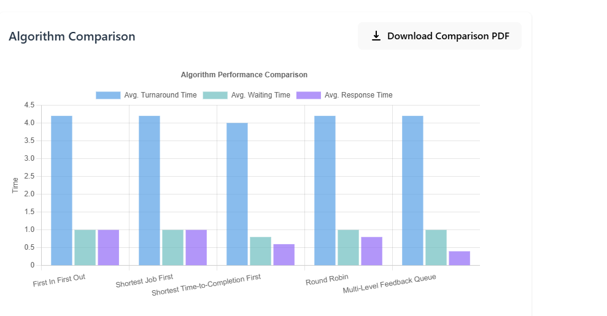
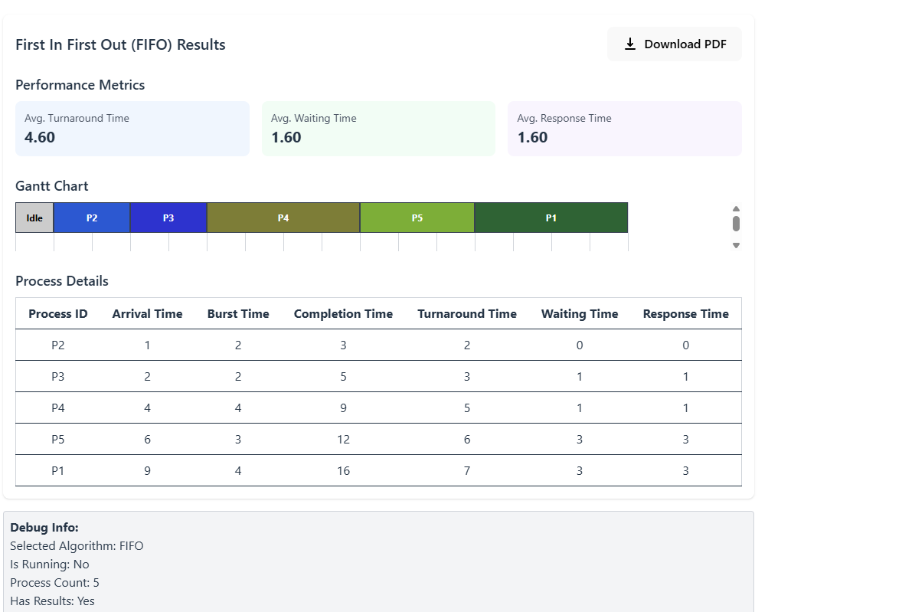

# CPU Scheduling Simulator
A web app that simulates some CPU scheduling algorithms

## Project Setup
For this simulation, we'll be using React + Vite scaffolding with SWC (rust based)

Other dependencies include 
- TailwindCSS for styling
- Chart js 
- JSpdf to generate downloadable results in pdf format
- Github pages for SPA deployment 

# Feature #1

Generate a basic set of processes with a control component to determine number of processes and time quantum for round robin

Processes also have color indicators to differentiate them

Sort through processes by arrival time and clear processes when done

## Feature 2

Multi-select tool for running varius algorithms

You can select from a list of algorithms or have the option to select all and run them based on the generated processes

Running all algorithms

Click on "Generate processes" to generate a number of processes and then click "Run all algorithms" 

We are met with a display of bar charts and gantt charts outlining and comparing performance across each of the algorithms

## Feature 3 - Downloading and Saving Results
Finally, we can save our results to a pdf for either single algorithm instances or after running all algorithms

Comparison PDF

Single algorithm metric pdf (FIFO example)
