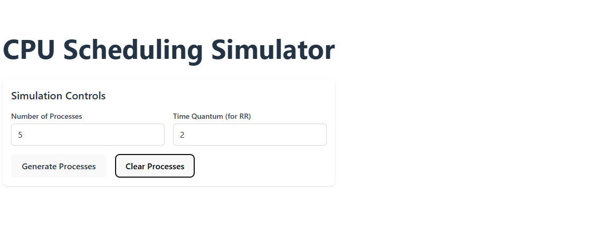

# CPU Scheduling Simulator
A web app that simulates some CPU scheduling algorithms

## Project Setup
For this simulation, we'll be using React + Vite scaffolding with SWC (rust based)

Other dependencies include 
- TailwindCSS for styling
- Chart js 
- JSpdf to generate downloadable results in pdf format
- Github pages for SPA deployment 

# Feature #1

Generate a basic set of processes with a control component to determine number of processes and time quantum for round robin

Processes also have color indicators to differentiate them

Sort through processes by arrival time 

Clear processes 
