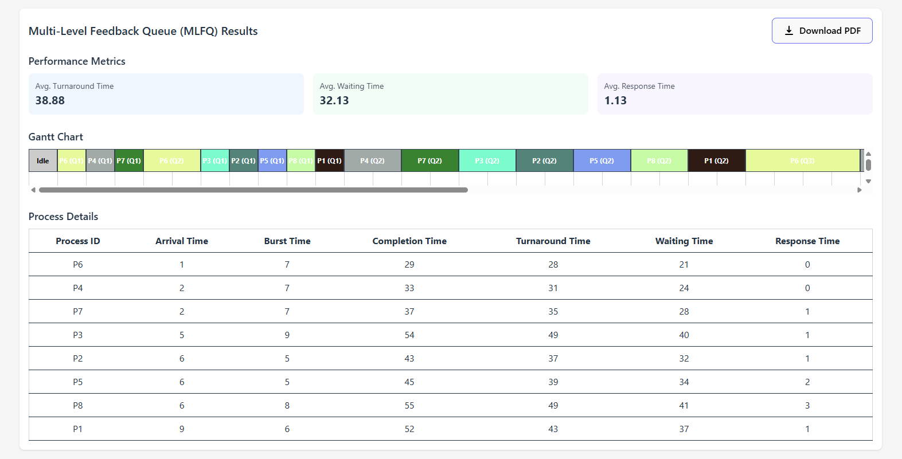

# CPU Scheduling Simulator
A web app that simulates some CPU scheduling algorithms

## Project Setup
For this simulation, we'll be using React + Vite scaffolding with SWC (rust based)

Other dependencies include 
- TailwindCSS for styling
- Chart.js for visualizing metrics
- jsPDF to generate downloadable results in PDF format
- GitHub Pages for SPA deployment 

## Features

### Feature 1: Process Generation and Management

Generate a basic set of processes with a control component to determine number of processes and time quantum for round robin.

Processes also have color indicators to differentiate them:

Sort through processes by arrival time and clear processes when done:

### Feature 2: Multiple CPU Scheduling Algorithms

Multi-select tool for running various algorithms.

You can select from a list of algorithms or have the option to run all algorithms using the generated processes:

Running all algorithms:

Click on "Generate processes" to generate a number of processes and then click "Run all algorithms". 

We are met with a display of bar charts and Gantt charts outlining and comparing performance across each of the algorithms:

### Feature 3: Exporting Results

Finally, we can save our results to a PDF for either single algorithm instances or after running all algorithms.

Comparison PDF:

Single algorithm metric PDF (FIFO example):

## Deployment

This project is deployed using GitHub Pages. You can visit the live application at: https://Geller99.github.io/ScheduleSim/

To deploy yourself:

1. Clone the repository
2. Install dependencies: `npm install`
3. Run the development server: `npm run dev`
4. Build and deploy: `npm run deploy`

## Algorithms Implemented

1. **FIFO (First In First Out)**: Processes are executed in the order they arrive.
2. **SJF (Shortest Job First)**: Processes with the shortest burst time are executed first.
3. **STCF (Shortest Time-to-Completion First)**: Preemptive version of SJF where processes with the shortest remaining time are prioritized.
4. **RR (Round Robin)**: Each process gets a fixed time slice in a circular manner.
5. **MLFQ (Multi-Level Feedback Queue)**: Uses multiple priority queues with different time quantums.

## Technologies Used

- React + Vite
- TypeScript
- TailwindCSS
- Chart.js
- jsPDF